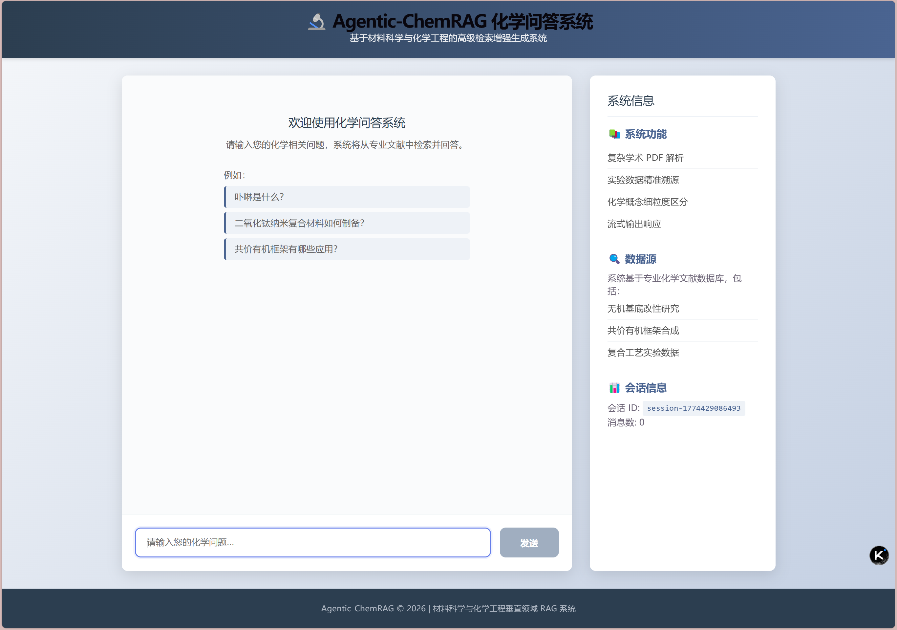
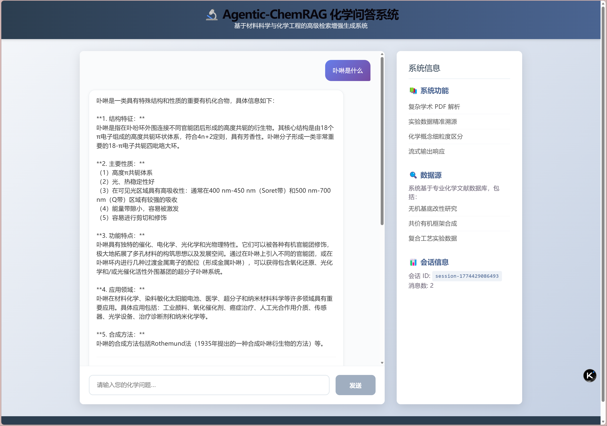
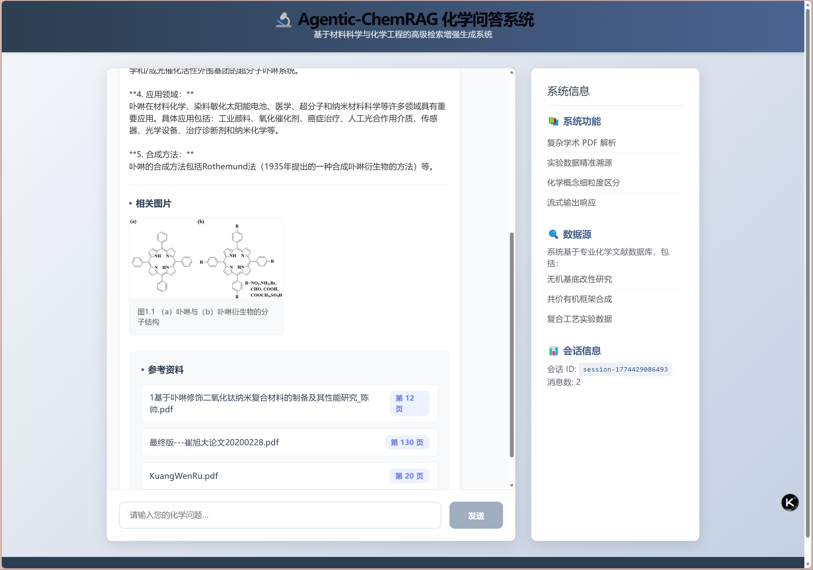
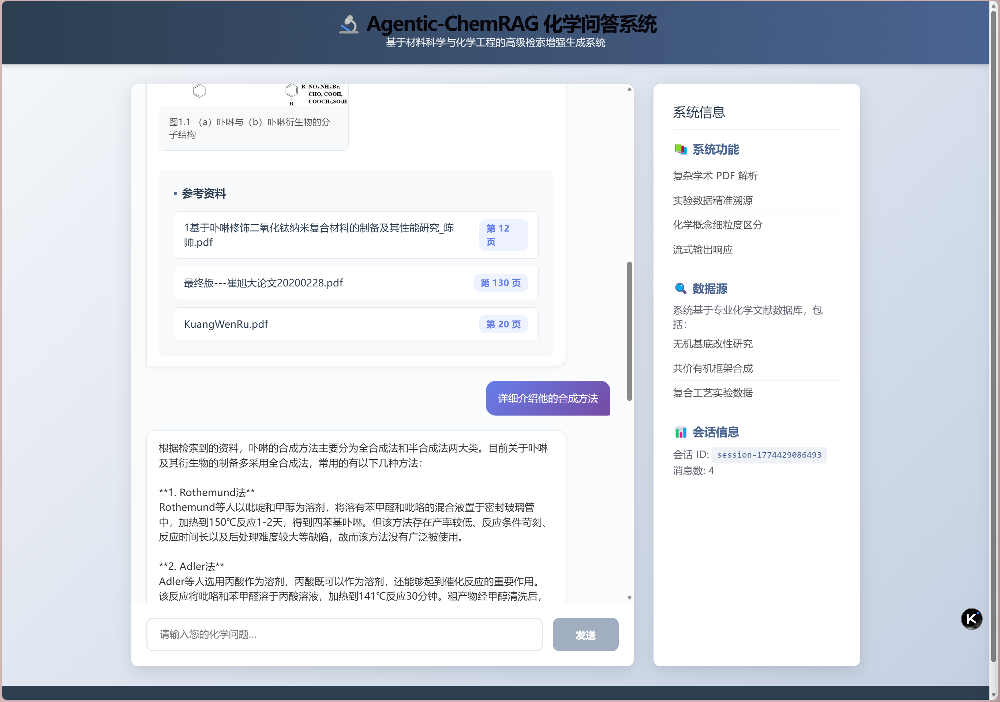
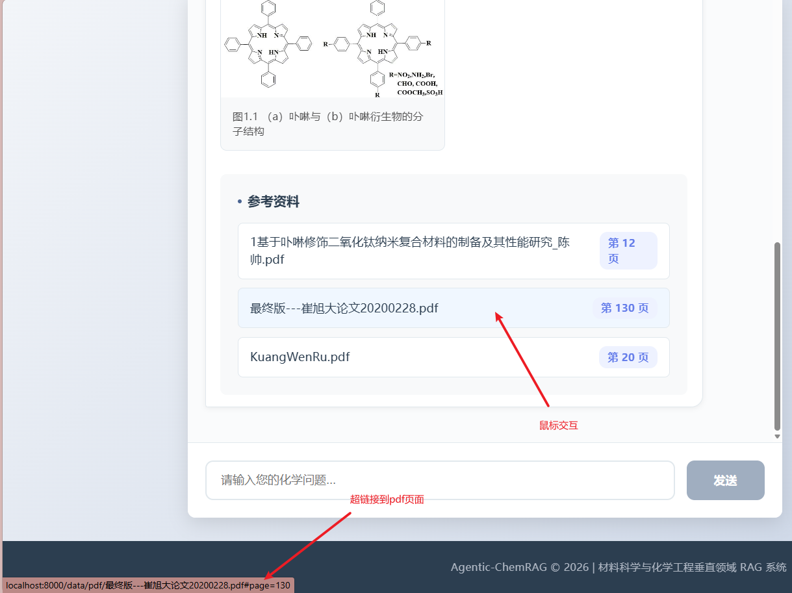
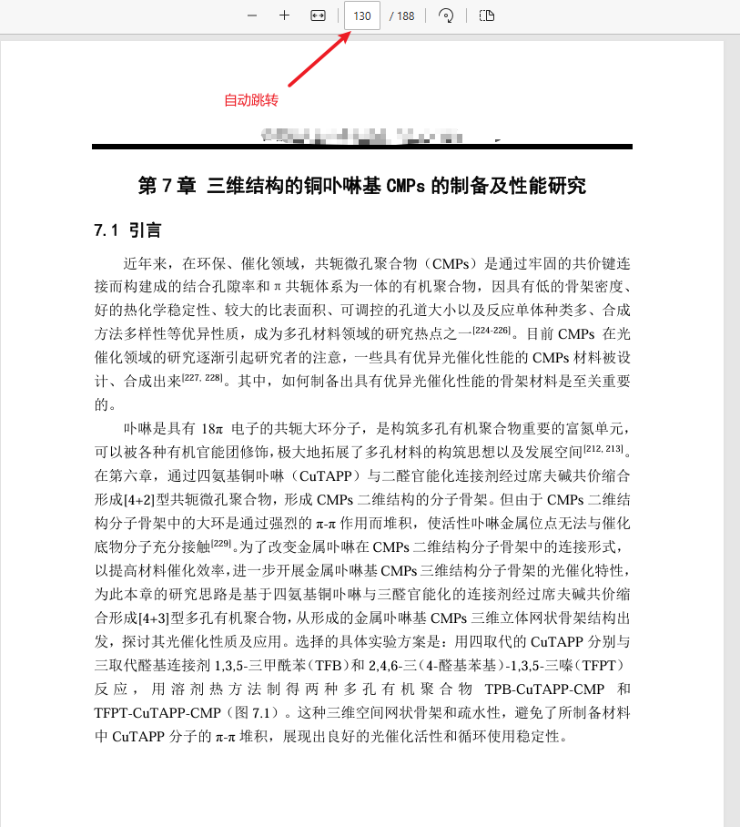

# Agentic-ChemRAG 🔬

[](https://www.python.org/downloads/release/python-3100/)
[](https://python.langchain.com/)
[](https://fastapi.tiangolo.com/)
[](https://vuejs.org/)
[](https://www.trychroma.com/)
[](https://opensource.org/licenses/MIT)

**Agentic-ChemRAG** 是一个专为材料科学与化学工程垂直领域打造的高级检索增强生成（Advanced RAG）全栈应用。

通用大模型在面对复杂的交叉学科文献时，常出现专业术语混淆与严重的“幻觉”问题。本项目通过构建专有的本地知识引擎与微服务后端，旨在实现对无机基底改性、共价有机框架合成及各类复合工艺实验数据的精准溯源、多轮智能问答及核心图谱的可视化渲染。

---

## 🎯 功能需求 (Functional Requirements)

* **复杂版式文献解析与多模态提取：** 能够精准解析包含双栏排版的学术 PDF，并在语义流中同步抽取 XPS、SEM 等实验谱图并本地落盘。
* **高精度的实验数据溯源：** 当提问涉及具体实验参数时，系统必须基于真实文献作答，并在输出中提供精确到“页码”的溯源定位。
* **上下文感知与多轮对话：** 系统需具备极强的指代消解能力，在多轮追问中自动补全主语，并支持多用户的并发隔离访问。
* **前后端解耦的结构化交互：** 后端提供标准的 RESTful API，严格约束大模型输出 JSON 格式（包含文本解答、参考文献与对应图片路径），供前端卡片化渲染。

---

## 🏗️ 架构设计 (System Architecture)

本项目采用模块化前后端分离设计，核心架构如下：

1. **数据清洗与入库管道 (Data Pipeline)：** 直接基于底层的 `fitz` (PyMuPDF) 引擎开发定制化解析器，捕获元素的 `Y0, X0` 物理坐标重构阅读顺序，同步完成文本清洗与图像提取。采用 `bge-small-zh-v1.5` 将文本块转化为高维向量注入 `ChromaDB`。
2. **双阶段检索核心 (Dual-Stage Retriever)：** * **召回阶段 (Bi-Encoder)：** 基于余弦相似度进行阈值过滤的粗排召回（Top-10）。
   * **精排阶段 (Cross-Encoder)：** 引入 HuggingFace `bge-reranker-v2-m3` 重排模型，利用 Transformer 交叉注意力机制截取最核心的 Top-3 语料，有效对抗垂直领域的“相似词汇幻觉”。
3. **双擎决策链 (Agentic LCEL Chain)：**
   * **引擎 A (独立问题生成)：** 结合历史会话，大模型执行指代消解，将用户模糊问题（如“它的比表面积是多少”）重写为独立查询语句。
   * **引擎 B (强约束抽取)：** 结合 Pydantic 进行 Schema 约束，利用大模型的 Function Calling 能力强制返回包含 `answer`, `images`, `sources` 的标准化 DTO 对象。
4. **BaaS 微服务层 (FastAPI Backend)：** 封装异步接口 `/api/chat`，内置基于 Session ID 的并发内存管理与滑动窗口记忆截断，并通过静态路由代理突破本地图片渲染的跨域壁垒。

---

## 🌟 核心工程亮点 (Core Highlights)

* **API 化强约束输出 (Structured Output)：** 彻底摒弃不可控的 Markdown 纯文本拼接，利用 LangChain `with_structured_output` 拦截器死死把控大模型输出格式。实现了业务逻辑与文本生成的彻底解耦，为前端复杂图文混排提供极其干净的数据源。
* **O(N) 级跨页元数据追踪 (Offset Mapping)：** 针对 RAG 切分容易丢失页码的业界痛点，自研全局偏移量映射算法。通过单向递增的双指针（Double Pointer）逻辑替代低效的嵌套循环，在 O(N) 时间复杂度下完美实现了切分块（Chunk）与物理 PDF 页码的精准绑定。
* **工业级多轮防爆机制 (Session & Context Control)：** 在极简的路由层实现了大厂标准的多用户 Session 隔离。结合基于轮数的滑动窗口切片（Sliding Window），彻底杜绝了多轮对话导致的 Context Window 溢出与 API 成本爆炸问题。

---

## 🧰 技术栈 (Tech Stack)

* **后端框架:** `FastAPI`, `Uvicorn`, `Pydantic`
* **AI 编排:** `LangChain` (LCEL), `Function Calling`
* **底层解析:** `PyMuPDF` (`fitz`), `正则表达式`
* **向量检索:** `ChromaDB`, `HuggingFaceEmbeddings` (BGE), `CrossEncoderReranker`
* **大语言模型:** DeepSeek / GLM-4 兼容接口 (`langchain_openai`)
* **前端展示:** `React 18`, `TypeScript`, `Vite`, `Axios`

---

## 🚀 快速启动 (Quick Start)

1. 安装依赖：`pip install -r requirements.txt`
2. 构建向量库：`python backend/build_vector_db.py`
3. 启动后端服务：`python backend/main.py` (默认运行于 http://localhost:8000)
4. 启动前端应用：
   ```bash
   cd frontend
   npm install
   npm run dev
   ```
   访问 http://localhost:5173 开始对话。

---

## 🗺️ 未来改进方向 (Roadmap)

- [ ] **多模态智能体扩展 (Multimodal Agent):** 对接 Qwen-VL 等视觉大模型，深度解析本地谱图，实现“以文找图”和图表 QA。
- [ ] **外部知识图谱融合 (Function Calling):** 编写自定义 Tool 接入 PubChem 等外部 API，自动路由理化常数查询。
- [ ] **高并发推理加速架构:** 结合 vLLM 推理框架的 PagedAttention 机制，并引入 Redis 作为 Semantic Cache（语义缓存），优化 QPS 表现。

---
## 🖥️ 系统运行演示 (System Demo)

**1. 极简极客风聊天主界面**


**2. 多模态精准图文解析渲染**



**3. 工业级多轮记忆管理与精准溯源跳转**


